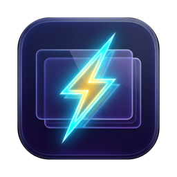

<div align="center">



# ZappDesk

**Instant desktop switching for macOS.**

Switch Spaces with no animation. Keyboard, trackpad, or ⌘-Tab.

[](#install)
[](#building)
[](#updates)
[](https://github.com/vzandli/ZappDesk/releases/latest)

</div>

## What it does

- **Instant Space switch.** Your existing `⌃←` `⌃→` and direct-desktop shortcuts jump without the slide. Shortcut changes in System Settings are picked up within a second.
- **Instant App switch.** ⌘-Tab or click the Dock to reach an app on another desktop and land there immediately.
- **Instant Trackpad swipe.** Multi-finger horizontal swipes, including mid-swipe reversal.
- **Your speed.** Dial the transition from instant to a faster version of the stock animation.
- **Stays out of the way.** Menu bar app with optional Dock icon, launch at login, and `⌥⌘,` to open Settings from anywhere.

Long jumps are sent one desktop at a time and stop safely on timeouts, display changes, or unexpected navigation. ZappDesk counts confirmed transitions and shows a conservative estimate of time saved.

## Install

1. Download `ZappDesk-x.y.z.zip` from the [latest release](https://github.com/vzandli/ZappDesk/releases/latest).
2. Move **ZappDesk.app** to Applications and open it.
3. Allow it in **System Settings → Privacy & Security → Accessibility**.

Signed with a Developer ID certificate and notarized by Apple.

## Updates

ZappDesk checks for updates in the background and on demand from the menu bar or **Settings → About**. Every update is verified with an EdDSA signature before it installs. If a scheduled check finds a new version while you are working, the menu shows **Update to x.y.z Available…** instead of interrupting you.

## Requirements

- macOS 14 Sonoma or later. Tested through macOS 27.
- Accessibility permission.

Space control relies on undocumented system interfaces, so each new macOS release is verified before it is supported.

## Building

```bash
git clone https://github.com/vzandli/ZappDesk.git
cd ZappDesk
open ZappDesk.xcodeproj
```

Requires Xcode 26.6 or later. Sparkle is the only dependency and resolves through Swift Package Manager.

Command line:

```bash
xcodebuild -project ZappDesk.xcodeproj -scheme ZappDesk -configuration Release -derivedDataPath DerivedData build
open DerivedData/Build/Products/Release/ZappDesk.app
```

Run the Xcode-built `.app` for URL handling and launch at login; the bare Swift package executable does not register those.

## Tests

```bash
swift test
```

Covers shortcut parsing, gesture thresholds, payload replacement, window filtering, login-item handling, and sequential switching under failure, timeout, cancellation, display removal, and desktop reordering. Nothing in the suite posts input or moves desktops. Hardware checks live in [docs/MANUAL-TESTS.md](docs/MANUAL-TESTS.md).

## Layout

```
ZappDesk/
├── App/        Lifecycle, event taps, Space switching, shortcuts, Sparkle
├── UI/         Menu bar, Settings window and panes
└── Resources/  App icon
Configuration/  Info.plist
Tests/          XCTest suite
scripts/        Release automation
```

## License

Copyright © 2026 ZYORK SOFTWARE LLC. All rights reserved.
